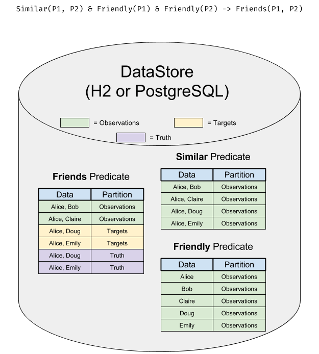
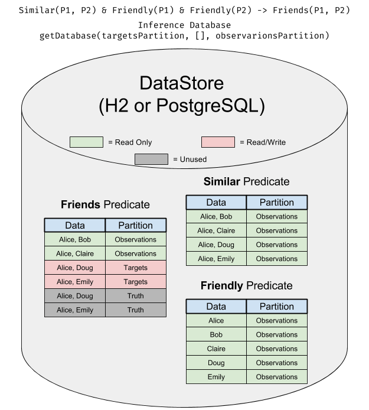
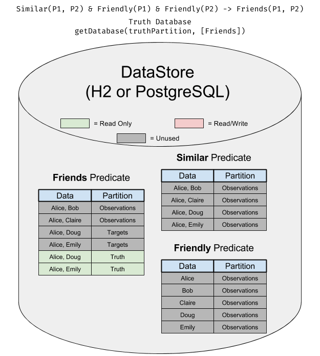

There are several levels of data abstraction in PSL to help manage and isolate data:
 - [DataStore](../../api/2.1.0/org/linqs/psl/database/DataStore.html)
 - [Database](../../api/2.1.0/org/linqs/psl/database/Database.html)
 - [Partition](../../api/2.1.0/org/linqs/psl/database/Partition.html)

## DataStore
The [DataStore](../../api/2.1.0/org/linqs/psl/database/DataStore.html) represents the physical place that all the data is stored.
It matches one-to-one with an actual RDBMS database instance (either H2 or PostgreSQL).

All data is stored in tables organized by predicate (one predicate to a table).

Databases are created using their constructor.

In this diagram, you can see how the data resides in the DataStore:  

## Database
The [Database](../../api/2.1.0/org/linqs/psl/database/Database.html) is like a view onto a DataStore where subsets of the data are assigned to be read/write, read-only, or inaccessible.
This makes it easy to do things like have observations and truth in the same database without worrying about one leaking into the other.

To get a database, you call `DataStore.getDatabase()` on a DataStore.  
`getDatabase()` takes two required arguments and one variadic argument:
1. The write partition (this partition will be marked as read/write).
2. A set of predicates to be considered "closed".
3. Any number of read partition (these partitions will all be marked as read-only).

In this diagram, you can see what a Database set up for inference looks like:  

In this diagram, you can see what a Database set up as a truth for weight learning or evaluation looks like:  

## Partition
A [Partition](../../api/2.1.0/org/linqs/psl/database/Partition.html) is the most fine-grained collection of data in PSL.
Every ground atom (piece of data) belongs to **exactly one** partition.
Within a partition, all data must be unique (an exception will be thrown during data loading if this is broken).

In most cases, you will want two or three partitions for inference:
 - `observations` - for observed data that has a fixed value.
 - `targets` - for the data you want to infer.
 - `truth` - optional truth values for that targets that you can use for evaluation.
